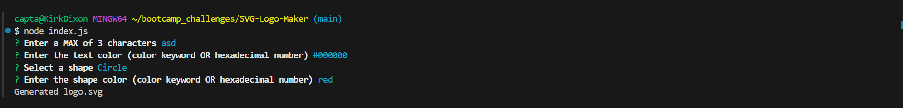
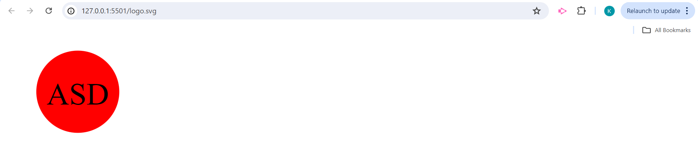

# SVG Logo Maker

## Description

This command line application allows the user to answer questions that pertain to creating a SVG logo and generates one using the user's answers.

## Installation

To install necessary dependencies, run the following command:

...

'npm i'
...

## Usage

To use this application, open the terminal in the index.js file, input 'npm index.js', and press 'Enter'. The application will ask for a maximum of three characters for the logo, the text color (as a color keyword or hexadecimal number), the shape (with the choice of either triangle, circle, or square), and the shape color (as a color keyword or hexadecimal number). A message will then verify that the file has been successfully generated using your answers. 

[Walkthrough Video](https://drive.google.com/file/d/1eIchoVKaJNk7GMoaYnBjUKlur8RVzFIp/view?usp=drive_link)

## Credits

geeksforgeeks(26 Dec, 2022)Regex Tutorial – How to write Regular Expressions?[Source code]https://www.geeksforgeeks.org/how-to-validate-hexadecimal-color-code-using-regular-expression/ 

## License

LICENSE in repo.

## Tests

To run tests, run the following command:

...

npm test
...